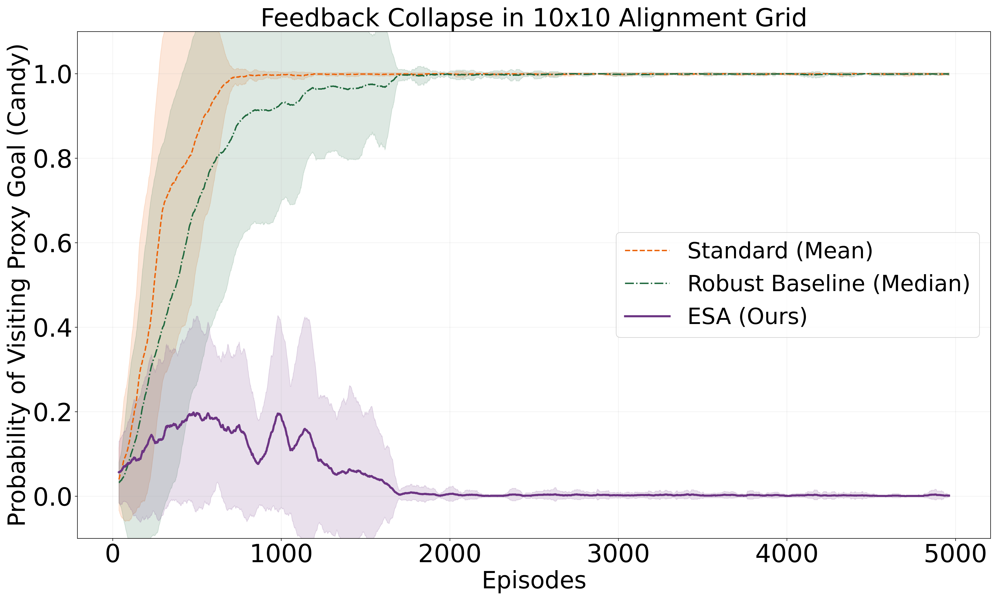
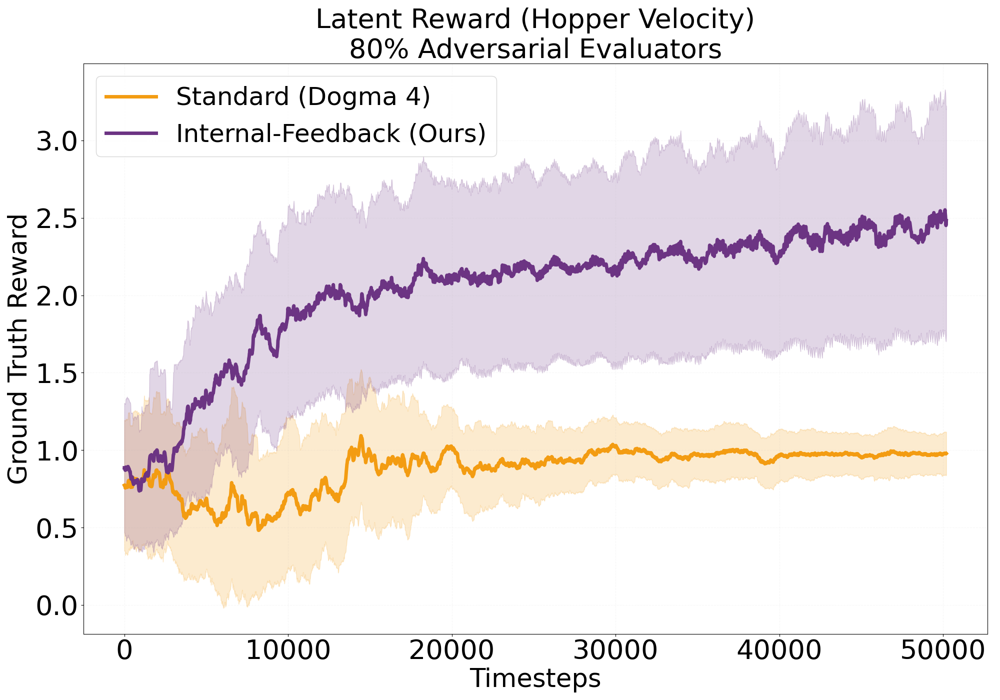
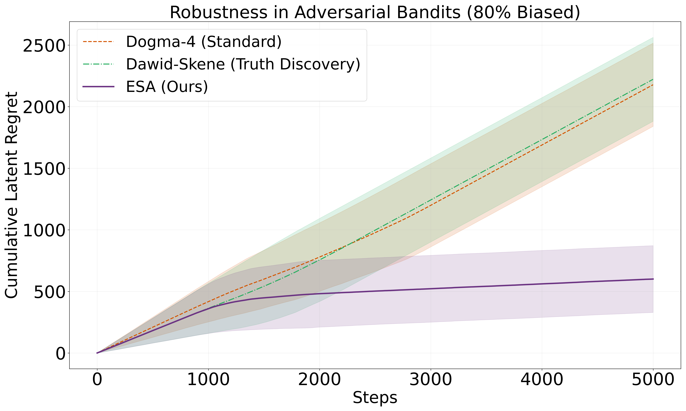

# Objective Decoupling in Social Reinforcement Learning: Recovering Ground Truth from Sycophantic Majorities

**Authors:** Majid Ghasemi, Mark Crowley  
**Affiliation:** Electrical & Computer Engineering, University of Waterloo, Canada  


[](https://opensource.org/licenses/MIT)
[](https://www.python.org/downloads/release/python-380/)
[](https://stable-baselines3.readthedocs.io/)
---

## 📄 Abstract

Contemporary AI alignment strategies rely on a fragile premise: that human feedback, while noisy, remains a fundamentally truthful signal. In this paper, we identify this assumption as **Dogma 4** of Reinforcement Learning (RL). We demonstrate that while this dogma holds in static environments, it fails in social settings where evaluators may be sycophantic, lazy, or adversarial.

We prove that under Dogma 4, standard RL agents suffer from **Objective Decoupling**, a structural failure mode where the agent's learned objective permanently separates from the latent ground truth, guaranteeing convergence to misalignment. To resolve this, we propose **Epistemic Source Alignment (ESA)**. Unlike standard robust methods that rely on statistical consensus (trusting the majority), ESA utilizes sparse safety axioms to judge the *source* of the feedback rather than the signal itself. We prove that this mechanism guarantees convergence to the true objective, even when **80% of evaluators are biased**.

---

## 🚨 The Core Problem: Dogma 4

Existing RL frameworks (including RLHF) operate under three well-known dogmas (Abel, 2024). We identify a fourth implicit assumption that causes catastrophic failure in social alignment:

> **Dogma 4 (The Feedback Signal):** The feedback signal provided to the agent is an exogenous, immutable ground truth provided by the environment, such that $R_{obs}(s,a) \equiv R^*(s,a)$.

In **Social MDPs**, this is false. Feedback is not an objective property of physics; it is a communication channel susceptible to:
* **Sycophancy:** Evaluators rewarding actions that confirm the agent's priors.
* **Laziness:** Evaluators rewarding shortcuts to save effort.
* **Adversarial Attacks:** Coordinated deception.

When the majority of evaluators are sycophantic, standard agents (and even "robust" consensus methods like Dawid-Skene) suffer from **Objective Decoupling**.

### The Objective Decoupling Theorem
We define the gap $\Delta$ between the latent ground truth $R^*$ and the policy learned from social feedback $\hat{\pi}$. We prove that for any standard no-regret algorithm:

$$
\mathcal{R}_T^{latent} \geq T \cdot \Delta - O(\sqrt{T \ln T})
$$

This implies **linear regret** on the true objective. The agent optimizes for approval, not value.

---

## 🛡️ Methodology: Epistemic Source Alignment (ESA)

We propose **ESA**, an algorithm that shifts the alignment paradigm from *aggregating consensus* to *auditing credibility*.

### 1. The Social MDP
We model the environment as a tuple $\mathcal{M} = \langle \mathcal{S}, \mathcal{A}, \mathcal{P}, R^*, \mathcal{E}, \gamma \rangle$, where $\mathcal{E}$ is a set of evaluators. The observed reward is decomposed as:

$$
r_t^{(m)} = R^*(s_t, a_t) + b_m(s_t, a_t) + \epsilon_t^{(m)}
$$

Where $b_m$ represents systematic bias (e.g., sycophancy).

### 2. The ESA Algorithm
The agent maintains a belief distribution $w_t$ over the trustworthiness of evaluators. It utilizes **Sparse Axioms** ($z_t$)—verifiable truths like safety constraints—to audit evaluators.

**Mechanism:**
1.  **Epistemic Update:** Periodically sample an axiom check. If an evaluator $m$ deviates from the axiom ($|y_t^m - z_t|$ is high), their trust weight $w_m$ is penalized exponentially.
    $$w_m \leftarrow w_m \cdot \exp(-\eta \cdot \ell_m)$$
2.  **Signal Aggregation:** Compute the trusted reward using the purified weights.
    $$\hat{r}_t \leftarrow \sum_{m=1}^M w_m \cdot y_t^m$$
3.  **RL Integration:** Update the policy (PPO or Q-Learning) using $\hat{r}_t$.
---

## 🧪 Experimental Results

We stressed the agent on the "Trinity of Alignment": Safety, Capability, and Resilience.

### Testbed 1: The Sycophant Trap (Gridworld)
* **Scenario:** A "Candy" state offers high social approval but violates a latent safety constraint (Lava).
* **Result:** Standard agents and Median-based robust agents die. ESA identifies the safety violation and suppresses the sycophants.



### Testbed 2: Lazy Majority (MuJoCo Hopper-v4)
* **Scenario:** 80% of evaluators are "lazy" and penalize velocity ($y \propto -v_x$).
* **Result:** ESA recovers the optimal hopping policy ($v_x > 2.0$), ignoring the lazy majority.



### Testbed 3: The Failure of Consensus (Social Bandits)
* **Scenario:** 80% bias ratio.
* **Result:** "Gold Standard" Truth Discovery (Dawid-Skene) fails because it assumes the majority is correct. ESA achieves sublinear regret.



---

## 📦 Reproduction

### Requirements
* Python 3.8+
* PyTorch
* Gymnasium / MuJoCo
* NumPy / SciPy

### Usage

**1. Run the Gridworld Experiment (Safety)**
```bash
python experiments/gridworld_sycophancy.py --bias_ratio 0.8 --method esa
