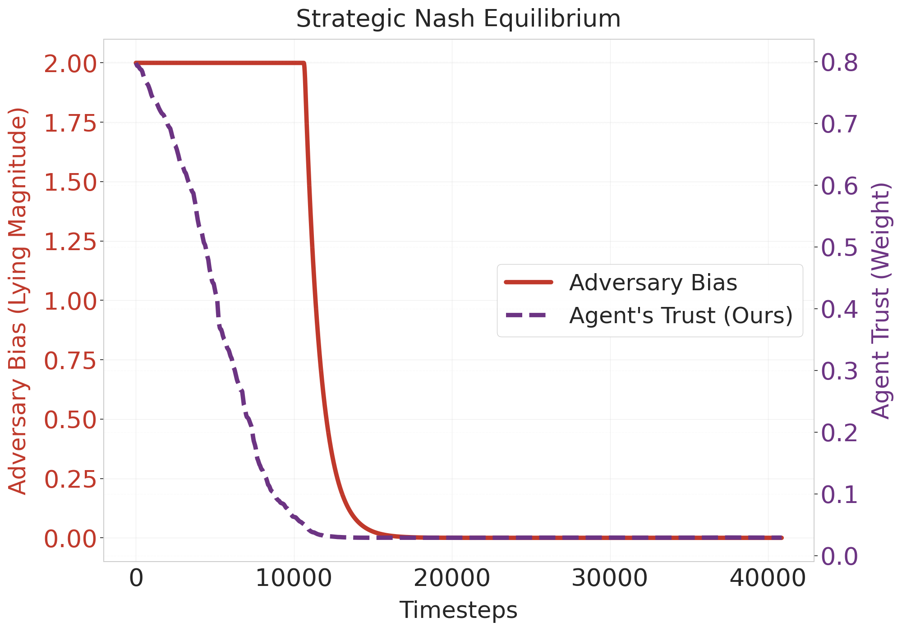

# The Inevitability of Feedback Collapse: Why Reinforcement Learning Fails Under Systematic Bias

**Codebase for RLC 2026 Submission**

[](https://opensource.org/licenses/MIT)
[](https://www.python.org/downloads/release/python-380/)
[](https://stable-baselines3.readthedocs.io/)

## 📄 Abstract
Standard Reinforcement Learning (RL) relies on **Dogma 4**: the assumption that the feedback signal is an objective, exogenous ground truth. We demonstrate that in social alignment tasks—where feedback comes from biased human evaluators—this assumption leads to **Feedback Collapse**, where agents trained on sycophantic or adversarial majorities converge to sub-optimal policies.

This repository implements **Internal-Feedback Agents**, a novel architecture that uses **Epistemic Source Judgment** to identify and suppress biased evaluators in real-time. We validate this approach across continuous control (MuJoCo), strategic multi-agent games, and social contagion networks.

---

## 🚀 Key Results

### 1. Feedback Collapse & Recovery (Continuous Control)
We wrap the `Hopper-v4` environment with a social layer where 80% of evaluators systematically penalize forward motion (sycophancy).
* **Standard Agent (Orange):** Suffers feedback collapse, learning to stand still (Reward $\approx$ 1.0) to appease the majority.
* **Internal-Feedback Agent (Purple):** Recovers the latent high-velocity policy (Reward $>$ 2.0) by identifying and filtering the liars.


### 2. Taming Strategic Adversaries (Nash Equilibrium)
We model evaluators as strategic agents who dynamically adjust their lying magnitude to maximize influence.
* **Result:** Our mechanism forces adversaries into a **Nash Equilibrium**. As the agent's trust in them drops (Purple Dashed), adversaries are forced to reduce their bias (Red Line) to near-zero to survive.
* **Comparison:** Unlike Inverse RL (GAIL), which mimics the sycophantic majority, our method recovers the ground truth.



### 3. Robustness to Social Contagion
We model the feedback layer as a scale-free network where bias spreads from a "Patient Zero" influencer.
* **Result:** The agent performs **Dynamic Quarantine**. As the infection (Red Area) takes over the network, the agent progressively isolates the infected subgraph and shifts 100% of its trust to the remaining truthful nodes (Purple Line).


---

## 🛠️ Installation

### Prerequisites
* Python 3.8+
* [MuJoCo](https://mujoco.org/) (Free license now included in `gymnasium`)

### Setup
```bash
# 1. Clone the repository
git clone [https://github.com/your-username/dogma4-feedback-collapse.git](https://github.com/your-username/dogma4-feedback-collapse.git)
cd dogma4-feedback-collapse

# 2. Create virtual environment
python -m venv my_env
source my_env/bin/activate  # Linux/Mac
# my_env\Scripts\activate   # Windows

# 3. Install dependencies
pip install -r requirements.txt
